# claw0 架构与原理通读

> 读码范围:`sessions/en/s01..s10` 全部 10 个文件(7,371 行),逐行读过。`zh/`、`ja/` 与 `en/` 逻辑完全一致,仅注释/文档语言不同,未单独通读。
> 行号引用形如 `s06:377` 表示 `sessions/en/s06_intelligence.py` 第 377 行;凡是论断,基本都能落到具体行。
> 本文以「架构原理 + 关键代码节选 + 图解」为主,不做逐函数走读。

---

## 目录

- [第 0 章 · 导读与阅读地图](#第-0-章--导读与阅读地图)
- [第 1 章 · 全景:一个内核,十层外壳](#第-1-章--全景一个内核十层外壳)
- [第 2 章 · s01 内核:while True + stop_reason](#第-2-章--s01-内核while-true--stop_reason)
- [第 3 章 · s02 工具:数据即工具,查表即调用](#第-3-章--s02-工具数据即工具查表即调用)
- [第 4 章 · s03 会话与上下文护栏](#第-4-章--s03-会话与上下文护栏)
- [第 5 章 · s04 通道:同一个大脑,多张嘴](#第-5-章--s04-通道同一个大脑多张嘴)
- [第 6 章 · s05 网关与路由:每条消息都有归宿](#第-6-章--s05-网关与路由每条消息都有归宿)
- [第 7 章 · s06 智能层:给它一个灵魂,教它记忆](#第-7-章--s06-智能层给它一个灵魂教它记忆)
- [第 8 章 · s07 心跳与 Cron:从被动到主动](#第-8-章--s07-心跳与-cron从被动到主动)
- [第 9 章 · s08 投递:先落盘,再发送](#第-9-章--s08-投递先落盘再发送)
- [第 10 章 · s09 韧性:三层重试洋葱](#第-10-章--s09-韧性三层重试洋葱)
- [第 11 章 · s10 并发:命名车道驯服混乱](#第-11-章--s10-并发命名车道驯服混乱)
- [第 12 章 · 横切观察(全书最有价值的一章)](#第-12-章--横切观察全书最有价值的一章)
- [第 13 章 · 若要做成真实系统:缺口清单](#第-13-章--若要做成真实系统缺口清单)

---

## 第 0 章 · 导读与阅读地图

### 这是什么

claw0 是一套 **教学代码**,不是一个能跑起来的整体产品。10 个 `.py` 文件,每个都能 `python en/sNN_xxx.py` 单独运行,彼此 **零 import**。每个文件从头实现一个完整的小程序,目标是「在上一节的认知基础上,把一个新概念讲透」。

所以读它的正确姿势不是「找 main 函数顺着调用链走」,而是 **横向对比**:同一个 `agent_loop` 在 10 个文件里反复出现,每次多包一层。你要盯住的是「这一节相比上一节,多了什么 / 少了什么」。

### 全书唯一不变量

把所有花哨外壳剥掉,claw0 的内核只有一句话,十节都没变过:

```
while True:
    response = client.messages.create(..., messages=messages)
    if   stop_reason == "end_turn": 打印,结束本回合
    elif stop_reason == "tool_use": 执行工具,把结果塞回 messages,继续循环
    else: 兜底打印
```

这就是 s01 的全部(`s01:91-155`),也是 s09 最里层 `_run_attempt` 的全部(`s09:842-880`)。中间 8 节做的所有事,都是在这个循环 **外面** 加东西:持久化、通道、路由、人格、定时、投递、重试、并发。内核一行没动。

### 一个必须先纠正的认知(全书心法)

项目的 `CLAUDE.md` 和各文件 docstring 都说「每节在上一节基础上**只加**一个概念,不重构早期代码」。**这句话只对了一半。**

真相是:前 6 节大致是累加的;但 **s07、s08、s10 是把前面的能力*简化重写*以聚焦新概念,不是严格超集**。最直接的证据——`MemoryStore` 这个类在项目里有 **三个互不相同的实现**:

| 文件 | MemoryStore 实现 | 检索方式 |
|------|------------------|----------|
| s06 | 双层存储 + TF-IDF + 向量 + 时间衰减 + MMR(`s06:268-557`) | hybrid_search 管线 |
| s07 | 单文件 `MEMORY.md` 全量读 | 子串匹配(`s07:107-112`) |
| s08 | `memory.jsonl` 逐行 | 子串匹配(`s08:494-512`) |
| s10 | 单文件 `MEMORY.md` | 子串匹配(`s10:308-313`) |

s07 之后的「记忆」比 s06 **退化** 了,因为那几节的主题是心跳/投递/并发,作者故意把记忆砍成最简版以免喧宾夺主。`HeartbeatRunner`、`ContextGuard` 也都有多个版本。**读这套代码时,不要假设后一节包含前一节的全部能力。** 记住这一点,后面很多「为什么这里又变简单了」的疑惑都能解开。

---

## 第 1 章 · 全景:一个内核,十层外壳

### 总图(故意不深入)

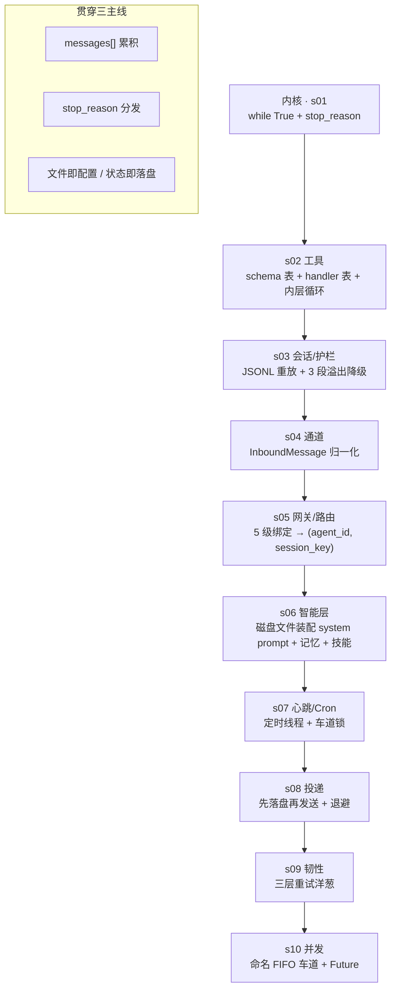

### 复杂度集中在哪

别被「10 节平均」骗了,行数和认知负担分布极不均:

| 节 | 行数 | 主题 | 真实难度 |
|----|------|------|----------|
| s01 | 172 | agent loop | 最轻,半小时能吃透 |
| s02 | 439 | 工具 | 轻 |
| s03 | 873 | 会话 + 护栏 | 中,`_rebuild_history` 是第一个硬骨头 |
| s04 | 792 | 通道 | 中偏重,Telegram 缓冲逻辑最绕 |
| s05 | 626 | 网关/路由 | 中,异步 + JSON-RPC |
| **s06** | **905** | **智能层** | **重,记忆检索管线一堆机制** |
| s07 | 659 | 心跳/Cron | 中,但藏着一个锁的坑(见第 8 章) |
| s08 | 869 | 投递 | 中,写盘语义要细看 |
| **s09** | **1133** | **韧性** | **最重,三层嵌套循环 + 失败分类** |
| s10 | 903 | 并发 | 重,Condition/generation/Future |

如果时间有限,**s06 和 s09 值得花两倍时间**;s01/s02 扫一遍即可。

### 三条贯穿主线

1. **`messages[]` 累积**:Anthropic Messages API 是无状态的,「记忆」就是把历史 `messages` 数组每次重发。十节都在围绕这个数组做文章——存它(s03)、按会话隔离它(s05)、压缩它(s03/s09)。
2. **`stop_reason` 分发**:end_turn / tool_use 两分支决定一切控制流。
3. **「文件即配置,状态即落盘」**:人格(`SOUL.md`)、记忆(`MEMORY.md`)、定时任务(`CRON.json`)、待投递消息、会话历史,全是磁盘文件。改文件就改行为,不碰代码。这是 claw0 最一致、最值得学的设计哲学。

---

## 第 2 章 · s01 内核:while True + stop_reason

### 全部代码就是一个 REPL

`agent_loop`(`s01:79-155`)做三件事:读输入 → 追加到 `messages` → 调 API → 看 `stop_reason`。

```python
messages: list[dict] = []          # s01:82  —— 整个"记忆"就是这个数组
while True:
    user_input = input(...)        # s01:93
    messages.append({"role": "user", "content": user_input})   # s01:105
    response = client.messages.create(
        model=MODEL_ID, max_tokens=8096,
        system=SYSTEM_PROMPT, messages=messages)               # s01:111
    if response.stop_reason == "end_turn":                     # s01:123
        ... 打印 + messages.append(assistant)
```

### 三个值得注意的点

- **tool_use 分支是占位**(`s01:136-138`):此时还没有工具,模型理论上不会返回 tool_use,但作者把分支先留好,下一节直接往里填。这是「结构先于功能」的教学手法。
- **错误处理即「回滚最后一条 user 消息」**(`s01:117-120`):API 失败时 `messages.pop()`,避免把一条没有对应回复的 user 消息留在历史里污染下一轮。这个「失败回滚」模式后面每一节都在重复(s02:`375-378`、s06:`858-861`…),是个贯穿全书的小约定。
- **`max_tokens=8096`** 是个随手定的魔数,十节里大多沿用(s09 也是 8096,s05/s08 降到 4096,单轮后台任务降到 2048)。没有理论依据,够用而已。

内核到此为止。后面所有复杂度都长在这个循环外。

---

## 第 3 章 · s02 工具:数据即工具,查表即调用

### 核心思想:工具 = 两张表

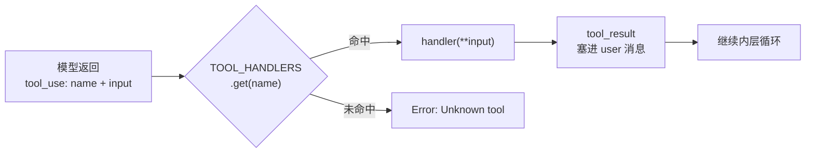

- `TOOLS`:给模型看的 JSON Schema 数组(`s02:215-298`),声明「有哪些工具、参数长什么样」。
- `TOOL_HANDLERS`:给代码看的 `name → 函数` 字典(`s02:300-305`)。
- `process_tool_call`(`s02:312-322`):查表 → `handler(**tool_input)`。一句话调度。

这个「schema 数据 + handler 映射」的拆分是整个 agent 工程的基石。模型只认 schema,代码只认函数名,两者用字符串 name 解耦。

### 新增的「内层循环」

s01 是「一问一答」;有了工具后,模型一个回合内可能 **连续多次** 调工具(读文件→编辑→再读)。于是 s02 在外层 while 里又套了一层 while(`s02:364-412`):

```python
while True:                      # 内层:工具调用链,直到 end_turn
    response = create(...)
    if end_turn: break
    elif tool_use:
        results = [process_tool_call(...) for block in ...]
        messages.append({"role": "user", "content": results})   # s02:407-411
        continue
```

**关键约束**:tool_result 必须以 `user` 角色塞回(`s02:407`,注释明说是 Anthropic API 要求)。这是初学者最常踩的坑——工具结果不是 assistant 说的,是「环境」反馈给模型的,在 API 语义里归到 user 侧。

### 安全:防得住君子,防不住高手

- `safe_path`(`s02:99-104`):把路径 resolve 后检查是否仍在 `WORKDIR` 下,挡路径逃逸。
- 危险命令黑名单(`s02:120-123`):`rm -rf /`、`mkfs`、`dd if=` 等子串匹配拒绝。

**我的判断**:这层防护是教学级的,真要绕很容易(`rm -rf /home`、`rm  -rf  /` 多空格、符号链接都能过)。`safe_path` 用 `str.startswith` 判断前缀(`s02:102`)也有经典缺陷:`/workdir-evil` 会被误判为在 `/workdir` 下。作者显然知道,这里是「演示有这道闸」,不是「这道闸够用」。

---

## 第 4 章 · s03 会话与上下文护栏

s03 在 agent loop 外包了两层:**SessionStore**(持久化)和 **ContextGuard**(防上下文溢出)。

### SessionStore:写时追加,读时重放

会话存成 JSONL,一行一个事件(user / assistant / tool_use / tool_result)。落盘路径:

```
workspace/.sessions/agents/<agent_id>/sessions/<session_id>.jsonl   # s03:132
```

> **文档漂移 ①**:`CLAUDE.md` 说会话在 `workspace/.agents/<agent_id>/sessions/`,实际代码是 `.sessions/agents/...`(`s03:132`)。以代码为准。`.agents` 这个目录名其实是 s05 用的(`s05:53`),两节没对齐。

写很简单(`append` 一行);**难点在读**——`_rebuild_history`(`s03:216-290`)要把扁平的事件流重组成 API 要求的「user/assistant 交替、tool_use 在 assistant 块里、tool_result 在 user 块里」的结构:

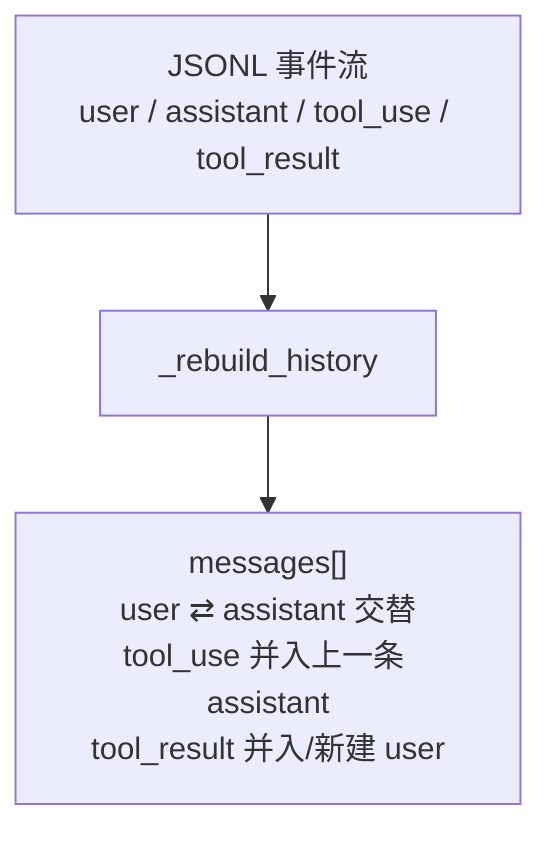

这段代码不长但分支密(`s03:250-288`):tool_use 要判断「上一条是不是 assistant,是就 append 到它的 content,否则新建」;tool_result 要判断「上一条是不是已含 tool_result 的 user 块」。**这是 s03 真正的硬骨头**,值得对着 API 的消息格式约束慢慢看。

### ContextGuard:三段降级,别让上下文撑爆

`guard_api_call`(`s03:463-518`)把一次 API 调用包成「失败就降级重试」:

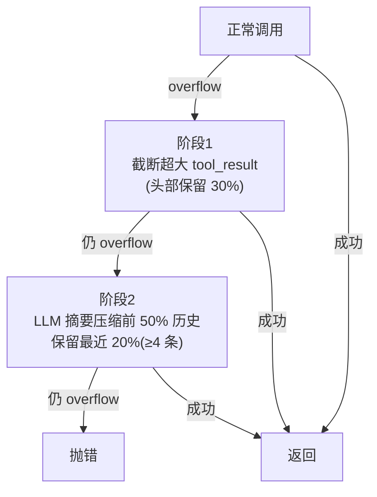

- 溢出判定靠 **字符串嗅探**:异常文本里有 `context` 或 `token`(`s03:498`)。粗糙但有效。
- token 估算用 **4 字符 ≈ 1 token**(`s03:345`)的经验魔数,纯本地估,不调 API。
- 压缩策略(`compact_history`,`s03:380-440`):前 50% 丢给模型做一段摘要,塞成一条假的 `[Previous conversation summary]` user 消息 + 一条假 assistant 确认(`s03:429-438`),再接最近 20%。摘要失败就直接丢弃旧消息(`s03:425-427`)——有损,但保命。

**魔数注意**:`CONTEXT_SAFE_LIMIT = 180000`(`s03:65`)是给 200k 上下文模型留的安全边际;50%/20% 的压缩/保留比例(`s03:390-391`)是拍脑袋的经验值,没有调参痕迹。

`/context`、`/compact`、`/switch` 等 REPL 命令(`s03:637-718`)是围绕这两个类做的调试入口,属于周边,扫一眼即可。

---

## 第 5 章 · s04 通道:同一个大脑,多张嘴

### 一个接口,N 个实现

s04 的主题是「平台差异收敛」。无论 Telegram、飞书还是 CLI,最终都产出同一个 `InboundMessage`(`s04:83-93`),agent loop 只认这个结构:

```python
@dataclass
class InboundMessage:                # s04:83
    text: str; sender_id: str
    channel: str = ""; account_id: str = ""; peer_id: str = ""
    is_group: bool = False
    media: list = ...; raw: dict = ...
```

`Channel` 抽象基类(`s04:114-124`)只规定两个方法:`receive()` 和 `send()`。加一个新平台 = 实现这两个方法,loop 一行不改。这是标准的「适配器模式」,也是本节唯一的核心思想。

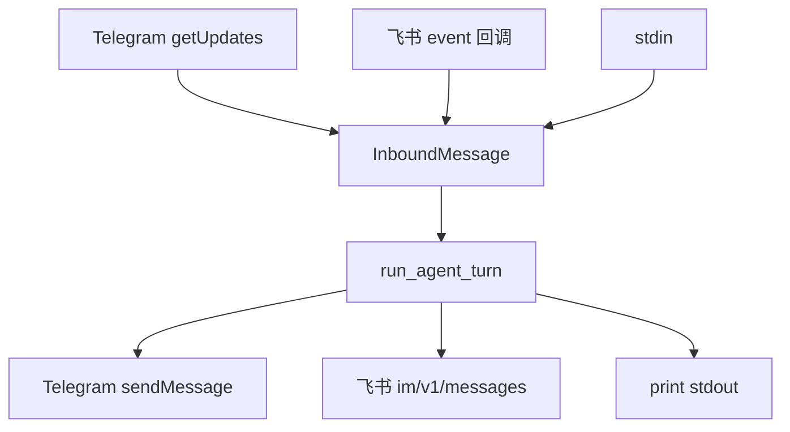

### Telegram 实现里藏着真实工程经验

`TelegramChannel`(`s04:170-362`)不是玩具,它处理了长轮询的一堆现实麻烦,这部分最值得读:

- **offset 持久化**(`s04:156-164, 223-225`):`getUpdates` 的 offset 落盘,重启不重收。
- **去重**:`_seen` 集合,涨到 5000 就清空以限制内存(`s04:231-232`)——又一个经验魔数。
- **媒体组缓冲**(`s04:239-243, 265-293`):一个相册会拆成多条 update,缓冲到 **0.5 秒静默** 再合并成一条。
- **文本合并**(`s04:252-301`):Telegram 会把长粘贴拆成多条,缓冲到 **1 秒静默** 再拼接。

这两个 flush 阈值(0.5s / 1s)是典型的「调出来的」值——太短会割裂消息,太长会显得卡顿。

### 两个坑

> **坑 ①**:`build_session_key`(`s04:107-108`)签名收了 `account_id` 参数却 **没用到**,key 模板是 `agent:main:direct:{channel}:{peer_id}`。多账号场景下会话不隔离。s05 把这个补上了(见第 6 章)。

> **坑 ②(Windows 相关)**:主循环在 Telegram 激活时用 `select.select([sys.stdin], ...)` 做非阻塞读(`s04:748-749`)。`select` 在 Windows 上 **只支持 socket,不支持 stdin**——本项目运行环境就是 Windows,这条路径在本机会直接抛错。CLI + Telegram 同时跑的模式实际上只在类 Unix 上成立。

飞书走的是 webhook + 主动拉 `tenant_access_token`(`s04:386-403`,token 提前 300 秒过期续期),`receive()` 直接返回 None(`s04:481-482`)——因为飞书是被动推送,没有轮询入口。这点和 Telegram 的长轮询形成对照。

---

## 第 6 章 · s05 网关与路由:每条消息都有归宿

s05 回答一个问题:一条消息进来,**该交给哪个 agent、归到哪个会话**?

### 5 级绑定表

`BindingTable`(`s05:101-139`)维护一组 `Binding`,按「从具体到泛化」5 级匹配:

| tier | 维度 | 含义 |
|------|------|------|
| 1 | peer_id | 指定某个用户 → 某 agent(最具体) |
| 2 | guild_id | 服务器/群组级 |
| 3 | account_id | 机器人账号级 |
| 4 | channel | 整个通道(如所有 Telegram) |
| 5 | default | 兜底(最泛化) |

实现很简洁:`add` 时按 `(tier, -priority)` 排序(`s05:107`),`resolve` 顺序遍历、**首个命中即返回**(`s05:121-139`)。因为已排序,tier-1 永远先于 tier-5 被检查,「最具体优先」自然成立。

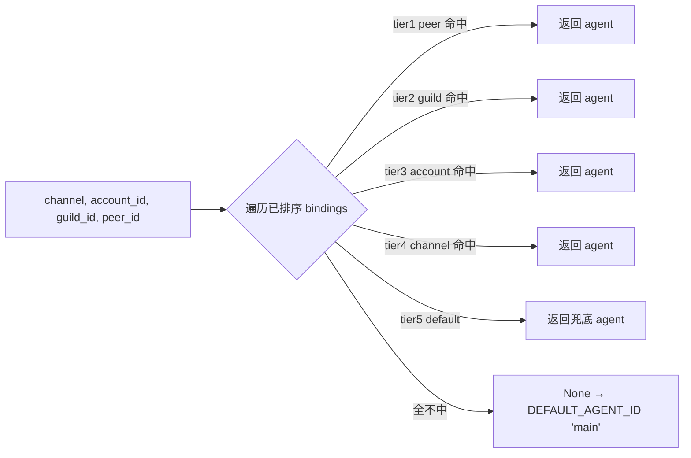

demo 绑定(`s05:472-487`)很说明问题:默认全归 `luna`,但 telegram 通道整体给 `sage`,而 `discord:admin-001` 这个具体人优先级 10 强制给 `sage`。三条规则就把「默认人格 + 渠道覆盖 + VIP 专属」表达出来了。

### session_key 与 dm_scope

`build_session_key`(`s05:150-162`)比 s04 版本完善:用 `dm_scope` 控制会话隔离粒度——`per-peer` / `per-channel-peer` / `per-account-channel-peer` / `main`。这就修了第 5 章说的 s04 那个 account_id 不隔离的坑。

`normalize_agent_id`(`s05:70-77`)用正则把任意字符串规整成合法 id(小写、`[a-z0-9_-]`、≤64 字符),非法字符替成 `-`。是个朴素但必要的输入清洗。

### 网关:WebSocket + JSON-RPC 2.0

`GatewayServer`(`s05:359-466`)把整套能力暴露成标准 JSON-RPC:`send` / `bindings.set` / `bindings.list` / `sessions.list` / `agents.list` / `status`(`s05:413-417`)。`_dispatch`(`s05:407-424`)是教科书式的 JSON-RPC 派发:解析失败 -32700、未知方法 -32601、业务异常 -32000。

异步这块有两个实现细节值得记:
- **共享事件循环**:`get_event_loop`(`s05:262-272`)起一个常驻后台线程跑 `run_forever`,让同步 REPL 也能 `run_coroutine_threadsafe` 调异步代码(`s05:274-276`)。这是「同步主程序 + 异步网关」共存的常见桥接。
- **并发闸**:`_agent_semaphore = Semaphore(4)`(`s05:304-310`)限制同时最多 4 个 agent 在跑;`_agent_loop` 内层有 **15 次** 工具循环硬上限(`s05:326`)防失控。

> 注意 `_agent_loop`(`s05:325`)是 s05 自己的异步版内层循环,和 s02 的同步版是两套代码——又一处「重新实现而非复用」。

---

## 第 7 章 · s06 智能层:给它一个灵魂,教它记忆

这是全书最重的一节(905 行),也是「文件即配置」哲学的高潮:**system prompt 完全由磁盘上的 Markdown 文件拼出来**,换文件就换人格,不碰代码。

### 每轮重建的 8 层 system prompt

`build_system_prompt`(`s06:636-708`)把 prompt 分 8 层拼接,**每个对话回合都重建一次**(`s06:843-846`,因为要带入实时记忆和时间):

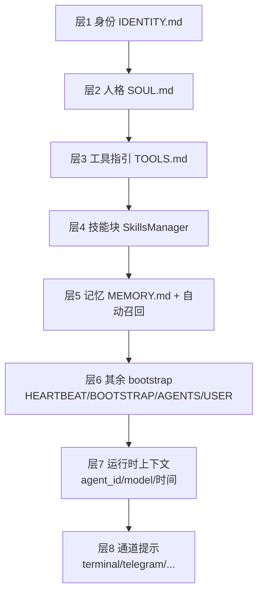

`BootstrapLoader`(`s06:106-147`)负责读这些文件,带三档模式(full / minimal / none),单文件截断 `MAX_FILE_CHARS=20000`、总量截断 `MAX_TOTAL_CHARS=150000`(`s06:62-63`)。「位置越靠前影响越强」是作者明确写下的设计意图(`s06:153` 注释)。

### 记忆检索:从朴素 TF-IDF 到「混合管线」

`MemoryStore`(`s06:268-557`)是双层存储:`MEMORY.md`(常青事实)+ `memory/daily/{date}.jsonl`(每日日志)。检索这块作者堆了一整套机制:

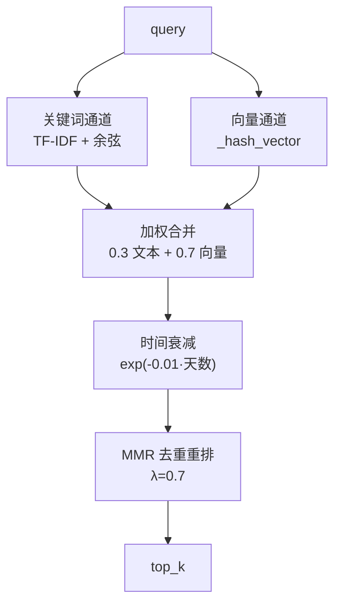

**这里有三个必须直说的判断:**

> **判断 ①:向量通道是「假」的。** `_hash_vector`(`s06:376-388`)注释自己写明「Simulated vector embedding... No external API needed -- teaches the PATTERN」。它把 token 哈希成 ±1 的符号投影向量,**没有任何语义**——两个近义词的「向量」毫不相关。而合并时它却占 **0.7 权重**(`s06:463`),即最终分数 70% 来自一个非语义的哈希噪声。这是教学占位,**生产环境必须换成真实 embedding**。明白这点,才不会误以为 claw0 自带了语义检索。

> **判断 ②:`search_memory` 是死代码。** `s06:329-372` 那个朴素 TF-IDF 版 `search_memory` 方法,**全项目无人调用**——工具走 `hybrid_search`(`s06:574`)、`/search` 走 `hybrid_search`(`s06:754`)、自动召回 `_auto_recall` 也走 `hybrid_search`(`s06:793`)。它是被 `hybrid_search` 取代后留下的遗留实现,读代码时可跳过。

> **文档漂移 ②:`CLAUDE.md` 说「SkillsManager 通过 TF-IDF 余弦相似度追加相关技能」——这是错的。** `format_prompt_block`(`s06:238-257`)只是把发现的 **所有** 技能按发现顺序全量拼进 prompt(到 `MAX_SKILLS_PROMPT=30000` 截断为止),**没有任何相关性计算**。TF-IDF 只存在于 `MemoryStore`,与技能无关。

### 技能发现

`SkillsManager.discover`(`s06:222-236`)按固定优先级扫多个目录(`workspace/skills`、`.skills`、`.agents/skills`、cwd 下的…),后扫的同名技能覆盖先扫的。每个技能是一个含 `SKILL.md`(带 frontmatter:name/description/invocation)的目录(`s06:191-220`)。`workspace/skills/example-skill/SKILL.md` 就是范例。

`_tokenize`(`s06:324-327`)特意处理了 CJK 单字(`一-鿿` 单字也算 token),这是为了中日文检索——和项目三语定位一致。

---

## 第 8 章 · s07 心跳与 Cron:从被动到主动

s07 让 agent 从「你问我才答」变成「我会定时自己干活」。两个独立机制:**Heartbeat**(周期性自检)和 **Cron**(定时任务)。

### Heartbeat:四道闸 + 非阻塞抢锁

`HeartbeatRunner.should_run`(`s07:170-187`)在真正干活前过四道闸:HEARTBEAT.md 存在且非空 → 间隔已到(默认 1800s)→ 在活跃时段内(默认 9-22 点)→ 没在跑。

真正的并发设计在 `_execute`(`s07:205-230`):

```python
acquired = self.lane_lock.acquire(blocking=False)   # s07:207 非阻塞
if not acquired:
    return                                            # 抢不到锁就放弃这次心跳
```

而用户回合用 **阻塞** 抢锁(`s07:602`)。一非阻塞一阻塞,实现了「用户永远优先,心跳见缝插针」——用户在交互时心跳自动让路。这个设计很漂亮。

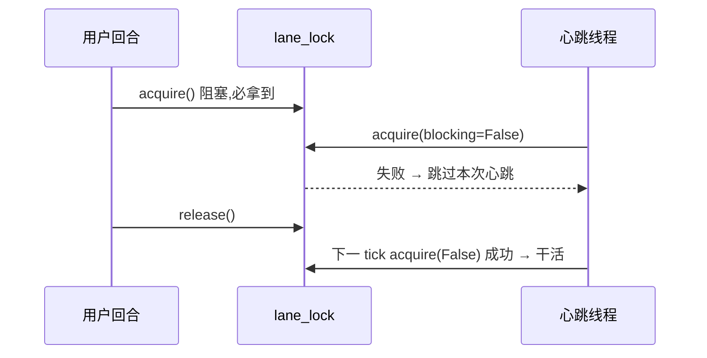

### Cron:三种调度 + 自动停用

`CronService`(`s07:328-461`)支持三种调度(`s07:352`):`at`(一次性)、`every`(固定间隔)、`cron`(5 段表达式,靠 `croniter` 解析,`s07:387`)。`CRON.json` 里四种用法都有:两个 `cron`、一个 `at`(带 `delete_after_run`)、一个 `every`。

容错:某 job 连续出错 ≥ 5 次(`CRON_AUTO_DISABLE_THRESHOLD`,`s07:312`)自动 `enabled=False`(`s07:432-433`),并把告警入队。每次运行写 `cron-runs.jsonl` 审计日志(`s07:442-451`)。

### 全书最隐蔽的一个坑:cron 根本不走锁

s07 的 docstring 和 `CLAUDE.md` 都说「心跳和 cron 都通过**单个 threading.Lock**和用户消息排队,用户优先」。**读代码会发现这是假的。**

`CronService.__init__`(`s07:329`)的签名只有 `cron_file`,**从头到尾没有 `lane_lock` 这个参数,`_run_job`(`s07:405-454`)里也没有任何 acquire**。也就是说:

- ✅ 用户回合 vs 心跳:通过 `lane_lock` 互斥(成立)
- ❌ 用户回合 vs cron:**毫无互斥**,cron tick 线程(`s07:513-520`)可以和用户回合 **同时** 调 API

所以「用户 vs cron 的车道互斥」在 s07 里 **并不存在**,与文档、甚至与本文件自己的 docstring(`s07:6`「Lane mutual exclusion gives user messages priority」)矛盾。这正是 s10 要解决的问题动机——见第 11 章,s10 用统一的命名车道把 cron 也纳进来。

---

## 第 9 章 · s08 投递:先落盘,再发送

s08 的口号是「Write to disk first, then try to send」。所有出站消息先写盘,再由后台线程尝试发送,失败退避重试,进程崩了重启扫盘续传。

### 写前日志(write-ahead)+ 原子写

`DeliveryQueue.enqueue`(`s08:184-196`)先生成一个落盘条目,再尝试发。落盘用 **临时文件 + fsync + `os.replace`** 保证原子性(`s08:198-207`):

```python
with open(tmp_path, "w") as f:
    f.write(data); f.flush(); os.fsync(f.fileno())   # s08:203-206
os.replace(str(tmp_path), str(final_path))           # s08:207 原子替换
```

这样即使写到一半崩溃,也不会留下半个损坏的 JSON——要么完整的旧文件,要么完整的新文件。

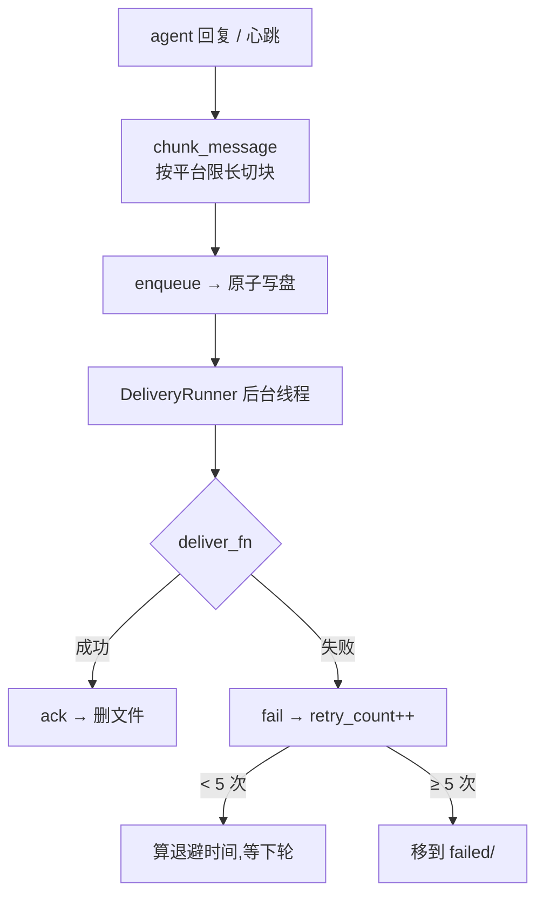

### 退避与恢复

- 退避梯度 `[5s, 25s, 2min, 10min]`(`s08:69`),`MAX_RETRIES=5`(`s08:70`),`compute_backoff_ms` 加 **±20% 抖动**(`s08:159-166`)防惊群。重试 1-5 次对应索引 0,1,2,3,3,即第 4、5 次都是 10 分钟封顶。
- 崩溃恢复:`DeliveryRunner.start` 先跑 `_recovery_scan`(`s08:367-379`)统计盘上残留的 pending/failed,再起后台循环。重启即续传,这是「先落盘」换来的红利。
- `MockDeliveryChannel`(`s08:442-459`)用 `fail_rate` 模拟不稳定网络,配合 `/simulate-failure` 命令(`s08:686-693`)让你亲眼看到退避重试。

> **教学副作用提醒**:`agent_loop` 里 assistant 文本先 `print_assistant` 直接打印,**又** `enqueue` 进投递队列(`s08:815-819`),而后台 runner 通过 `MockDeliveryChannel.send` 再打印一次(`s08:456`)。所以同一句回复你会看到两遍——这不是 bug,是为了演示「回复也走投递管道」,真实系统里直接打印那步会去掉。

---

## 第 10 章 · s09 韧性:三层重试洋葱

s09(1133 行,全书最重)把每次 agent 执行包进 **三层嵌套** 的容错结构,每层处理一类失败。

### 三层结构

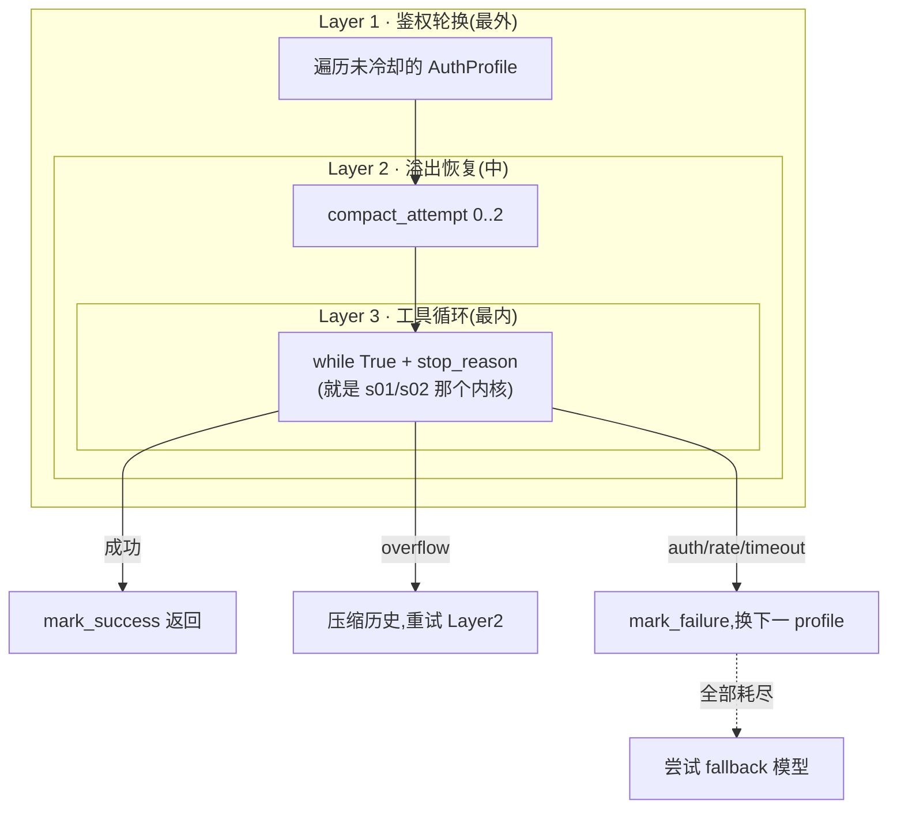

- **Layer 1**(`s09:674-767`):遍历 `AuthProfile` 列表,跳过在冷却期的。某 key 因 auth/rate/timeout 失败,就给它上冷却(时长按失败类型不同:auth/billing 300s、rate 120s、timeout 60s,`s09:744-760`),换下一把。
- **Layer 2**(`s09:697-733`):遇到上下文溢出,先截断 tool_result 再 LLM 摘要压缩,最多 `MAX_OVERFLOW_COMPACTION=3` 次(`s09:78`)。
- **Layer 3**(`s09:825-884`):就是 s01/s02 的 `while True + stop_reason`。`_run_attempt` 的实现和 s02 内层循环几乎逐行对应,只是把异常 **重新抛出** 给外层处理。

### 失败分类驱动一切

`classify_failure`(`s09:142-166`)纯靠 **异常字符串嗅探** 归类:有 `429`/`rate` → rate_limit,有 `401`/`auth`/`key` → auth,有 `timeout` → timeout……分类结果决定上面那套冷却/重试策略。粗糙但零依赖。

`SimulatedFailure`(`s09:565-603`)是个巧妙的教学工具:`/simulate-failure auth` 给下一次 API 调用「装填」一个合成异常(`s09:590-595`),让你不用真触发限流就能观察整套洋葱的反应。

### 两个「这是演示」的诚实标注

> **判断 ③:三把 key 是同一把。** demo 的 main-key / backup-key / emergency-key 用的是 **同一个** `ANTHROPIC_API_KEY`(`s09:1007-1023`,注释自承「use the same key for all three to keep the demo self-contained」)。所以真遇到 auth 失败,轮换到 backup 也会同样失败——轮换机制本身对,但 demo 数据让它在真实故障下无效。生产要换成不同 key。

> `fallback_models` 里写的 `claude-haiku-4-20250514`(`s09:1031`)是个 **占位/虚构** 的模型 id(真实的 Haiku 4.5 是 `claude-haiku-4-5`)。仅作 fallback 链演示。

`max_iterations` 用了个自适应公式 `min(max(24 + 8·profile数, 32), 160)`(`s09:644-648`),profile 越多允许的总迭代越多,封顶 160。又一组经验常量(`BASE_RETRY=24`、`PER_PROFILE=8`)。

---

## 第 11 章 · s10 并发:命名车道驯服混乱

s10 的动机正是第 8 章末尾那个坑:s07 的单把 `threading.Lock` 管不住 cron。s10 用 **命名 FIFO 车道** 系统替换它——`main` / `cron` / `heartbeat` 三条独立车道,各自串行,互不阻塞。

### LaneQueue:Condition + _pump + Future

`LaneQueue`(`s10:101-204`)是一条命名车道:一个 deque + 一个 `threading.Condition` + `_active_count`。核心是 `_pump`(`s10:141-155`):

```python
def _pump(self):                    # 必须持有 condition 时调用
    while self._active_count < self.max_concurrency and self._deque:
        fn, future, gen = self._deque.popleft()
        self._active_count += 1
        threading.Thread(target=self._run_task, ...).start()   # s10:149
```

每个任务用 `concurrent.futures.Future` 回传结果(`s10:134`),调用方 `future.result(timeout=120)` 同步等(`s10:876`)。任务完成后 `_task_done`(`s10:172-178`)减计数并 **再 pump 一次**,把队列里下一个拉起来——这就是 FIFO 串行的实现(`max_concurrency=1` 时一次只跑一个)。

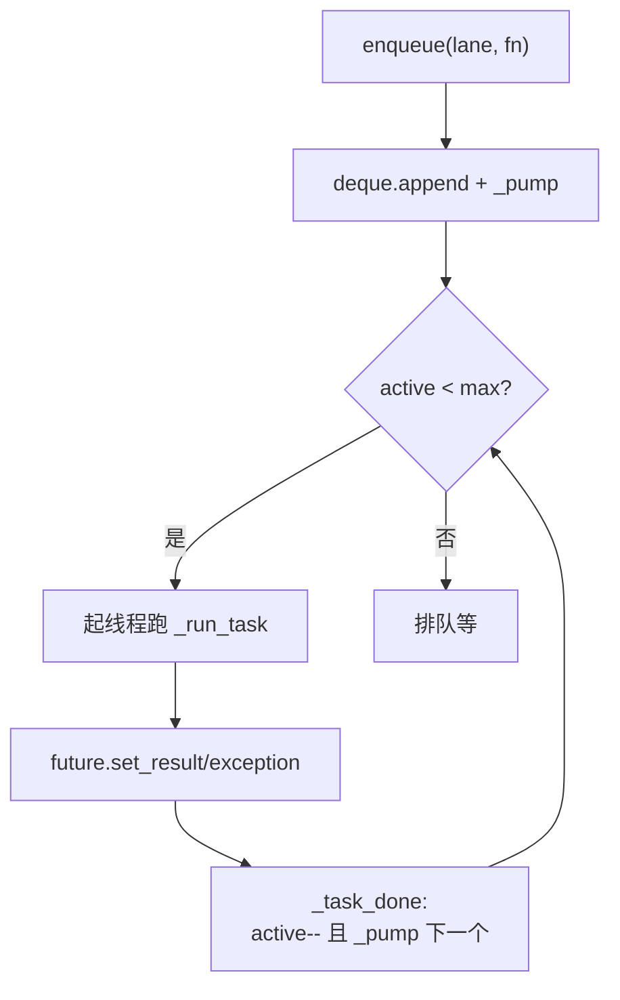

### generation:模拟重启时丢弃陈旧任务

`generation` 计数器(`s10:118-127`)解决一个微妙问题:`/reset` 模拟重启时 `reset_all` 给所有车道 `generation++`(`s10:236-247`)。`_task_done` 里 **只有当任务的 gen 仍等于当前 gen 才 re-pump**(`s10:176-177`)——这样老世代里还没跑完的陈旧任务完成后,不会再把队列拉起来,等于「软清空」了旧生命周期的遗留工作。这是个不显眼但考究的细节。

### 又一次「简化重写」:cron 退化了

> **判断 ④:s10 的 CronService 只认 `every_seconds`。** `load_jobs`(`s10:513-537`)直接读 `sched.get("every_seconds", 0)`,`every <= 0` 就跳过(`s10:524-526`)。它 **不再用 croniter,不再支持 `at` 和 `cron` 两种调度**。后果很具体:`CRON.json` 里 4 个任务,两个 `kind:"cron"`、一个 `kind:"at"` 全被静默跳过,**只有 `health-check`(every_seconds=3600)这一个能加载**。

对照 s07 的全功能 `CronService`(支持三种调度 + 自动停用 + 审计日志),s10 的版本明显是为了聚焦「车道并发」这个主题而砍掉的最简实现。**再次印证全书心法:后一节不是前一节的超集。** 如果你要一个「既有完整 cron 又有车道并发」的版本,得自己把 s07 的 `CronService` 和 s10 的 `CommandQueue` 缝起来——项目没替你做。

s10 把用户回合也改成 `enqueue(LANE_MAIN, ...)`(`s10:870-873`),于是用户、cron、心跳三类工作终于走同一套调度原语,各自一条 FIFO 车道。这才是 s07 那把锁「本应」长成的样子。

---

## 第 12 章 · 横切观察(全书最有价值的一章)

前面逐节看「树」,这一章看「林」。下面几张清单是通读全项目后才能给出的判断,单看任何一节都得不到。

### 12.1 不变量 vs「每节重新推导」

| 能力 | 出现的节 | 是累加还是重写? |
|------|----------|------------------|
| agent loop 内核 | s01–s10 全部 | **不变量**,一行没改 |
| 工具 schema+handler 双表 | s02 起 | 累加(但工具集每节不同) |
| ContextGuard | s03 / s09 | s09 是 s03 的精简内联版(`s09:266-271` 注释自承) |
| MemoryStore | s06 / s07 / s08 / s10 | **三套不同实现**,s07 后全部退化为子串匹配 |
| HeartbeatRunner | s07 / s08 / s10 | 三套,锁/车道语义各不同 |
| CronService | s07 / s10 | s10 砍到只剩 every_seconds |

**结论**:claw0 的「渐进」是 **概念渐进**,不是 **代码渐进**。每个文件是为讲清一个概念而自洽裁剪过的独立样本。把它当「同一个系统的 10 个版本」会处处困惑;当「围绕同一内核的 10 篇命题作文」就通了。

### 12.2 魔数总表(哪些是经验调出来的)

| 常量 | 值 | 出处 | 性质 |
|------|-----|------|------|
| max_tokens | 8096 / 4096 / 2048 | 各节 | 随手定,够用 |
| 4 字符 ≈ 1 token | — | s03:345 | 粗估,免调 API |
| CONTEXT_SAFE_LIMIT | 180000 | s03:65 | 200k 模型的安全边际 |
| 压缩/保留比 | 50% / 20% | s03:390-391 | 拍脑袋经验值 |
| 媒体组 / 文本 flush | 0.5s / 1s | s04:270,295 | **调出来的**,太短割裂太长卡顿 |
| _seen 清空阈值 | 5000 | s04:231 | 限内存的拍脑袋值 |
| Semaphore | 4 | s05:310 | 并发闸 |
| 内层循环上限 | 15 / 自适应≤160 | s05:326 / s09:644 | 防失控 |
| 混合检索权重 | 向量 0.7 / 文本 0.3 | s06:463 | **可疑**,因向量是假的(见 7 章判断①) |
| 时间衰减率 | 0.01/天 | s06:482 | 经验 |
| MMR λ | 0.7 | s06:499 | 相关性/多样性平衡 |
| 退避梯度 | 5s/25s/2min/10min + ±20% | s08:69,165 | 经典退避表 |
| MAX_RETRIES | 5 | s08:70 | — |
| cron 自动停用阈值 | 5 连错 | s07:312 | — |
| 冷却时长 | auth 300/rate 120/timeout 60s | s09:744-760 | 按失败类型分档 |

### 12.3 文档/注释 与 代码不一致清单(以代码为准)

1. **会话目录**:`CLAUDE.md` 说 `.agents/<id>/sessions/`,代码是 `.sessions/agents/<id>/sessions/`(`s03:132`)。
2. **SkillsManager**:`CLAUDE.md` 说用「TF-IDF 余弦相似度」挑相关技能;实际只全量拼接,无相关性计算(`s06:238-257`)。
3. **车道锁**:`CLAUDE.md` 和 s07 docstring 说心跳与 cron「都通过单个 Lock 与用户排队」;实际 cron 完全不碰锁(`s07:328-461`),用户 vs cron 无互斥。
4. **「只加不重构」**:`CLAUDE.md` 的总述;实际 s07/s08/s10 大量简化重写(见 12.1)。

### 12.4 遗留 / 未调用代码

- `MemoryStore.search_memory`(`s06:329-372`):被 `hybrid_search` 取代,全项目零调用,纯遗留。
- `s09` 里 `/context` 命令(`s09:975-978`)直接 `return False` 后注释自承是 no-op 占位。

### 12.5 可移植性与「教学省略」

- **Windows**:`s04:748` 的 `select.select(sys.stdin)` 在 Windows 不可用——而项目就跑在 Windows 上。CLI+Telegram 并行模式实际只在类 Unix 成立。
- **虚构模型 id**:`s09:1031` 的 `claude-haiku-4-20250514` 是占位。
- **最大的省略**:**没有任何一个主程序把 s04–s10 串起来**。每节是独立 demo——s05 有网关但没接 s04 的真实通道;s08 的投递队列没接 s05 的路由;s09 的韧性没接 s10 的车道。claw0 教的是「每个零件怎么造」,**没教「怎么把零件装成一台车」**。这是它作为 tutorial 的边界,也是第 13 章的话题。

---

## 第 13 章 · 若要做成真实系统:缺口清单

假设你想把这十节拼成一个真能上线的 agent 网关,按依赖顺序至少要补:

1. **一根主干**:写一个真正的进程,把 `ChannelManager`(s04)→ `Gateway/Routing`(s05)→ 智能层 prompt 装配(s06)→ 投递队列(s08)→ 韧性 runner(s09)→ 车道调度(s10)串成一条数据流。目前这条链在代码里 **不存在**。

2. **统一 MemoryStore / ContextGuard / Heartbeat / Cron**:从各节的多个版本里挑最全的(记忆用 s06 但换真 embedding、cron 用 s07、并发用 s10),合并成单一实现,消除 12.1 的分裂。

3. **替换教学占位**:
   - s06 的 `_hash_vector` → 真实 embedding API(否则混合检索的 0.7 权重是噪声)。
   - s09 的三把同 key → 真正不同的 key/provider。
   - 修正所有虚构模型 id。

4. **补 s10 的 cron**:把 s07 的 `at/every/cron` 三种调度 + croniter + 自动停用搬进 s10 的 `CronService`,否则车道版只会跑 `every_seconds` 任务。

5. **可移植性**:把 `s04` 的 `select(stdin)` 换成跨平台的输入方案(线程读 stdin / 平台分支),否则 Windows 跑不起 CLI+Telegram 并行。

6. **安全加固**:`safe_path`(s02)的前缀判断换成 `Path.is_relative_to`;危险命令黑名单换成白名单或沙箱;飞书/Telegram 的 token 校验补全(`s04:452` 那个 token 校验很弱)。

把这 6 件做完,claw0 才从「10 篇命题作文」变成「一个系统」。但反过来说——**作为教学,它的取舍是对的**:每节砍到只剩主题、不互相纠缠,正是它好读的原因。读者(你)负责在脑子里完成第 13 章这步装配,这本身就是这套教程留的「课后大作业」。

---

*(全文完。论断均基于 `sessions/en/*.py` 当前代码;若后续代码变动,以代码为准。)*
<style>
/* 仅导出 PDF / 打印时生效：把所有 Mermaid 图等比缩放到页宽，防止横向溢出。
   实时预览不受影响。需用 Markdown Preview Enhanced 或 Markdown PDF 扩展导出
  （VS Code 自带预览会过滤 <style>）。 */
@media print {
  .mermaid svg,
  pre.mermaid svg,
  svg[id^="mermaid"] {
    max-width: 100% !important;
    height: auto !important;
  }
}
</style>